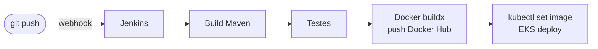
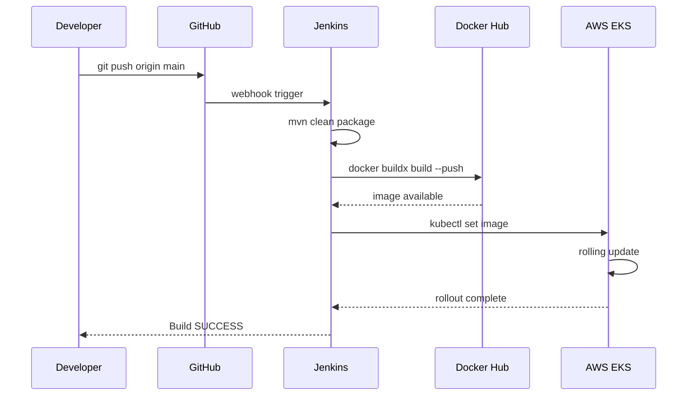

# CI/CD — Jenkins

## Visão Geral

O Jenkins é executado como container Docker, com acesso ao socket do host (`/var/run/docker.sock`) para construir e publicar imagens. Tem `kubectl` e `aws` instalados para deploy no EKS.



Para subir o Jenkins:

```bash
cd jenkins
docker compose up -d --build
```

Acesse em `http://localhost:9080`.

---

## Ferramentas Instaladas

| Ferramenta | Uso |
|-----------|-----|
| JDK 25 | Build Maven |
| Maven | `mvn package` |
| Docker CE | `docker buildx build` |
| kubectl | Deploy no EKS |
| AWS CLI v2 | `aws eks update-kubeconfig` |

---

## Credenciais no Jenkins

As credenciais são configuradas via **Jenkins > Manage Jenkins > Credentials** — **nunca hardcoded nos Jenkinsfiles**.

| ID no Jenkins | Tipo | Uso |
|--------------|------|-----|
| `dockerhub-credential` | Username/Password | Login no Docker Hub |
| `github-credential` | Username/Token | Clone de repositórios privados |
| AWS credentials | AWS Credentials | Deploy no EKS |

!!! info "Mecanismo withCredentials"
    O Jenkins injeta as credenciais como variáveis de ambiente durante o estágio, sem expô-las em logs:
    ```groovy
    withCredentials([usernamePassword(
        credentialsId: 'dockerhub-credential',
        usernameVariable: 'USERNAME',
        passwordVariable: 'TOKEN')]) {
        sh "docker login -u $USERNAME -p $TOKEN"
    }
    ```

---

## Pipelines

Cada microsserviço tem seu próprio `Jenkinsfile` com os estágios:

1. **Dependencies** — instala contratos Maven localmente
2. **Build** — `mvn clean package`
3. **Build & Push Image** — `docker buildx build --push` (multi-arch: amd64 + arm64)
4. **Deploy** — `kubectl set image` no cluster EKS

---

## Fluxo Completo



!!! info "secrets.yaml nunca no git"
    O arquivo `secrets.example.yaml` com placeholders `change-me` pode ser commitado. O `secrets.yaml` com valores reais **nunca** vai para o repositório.
