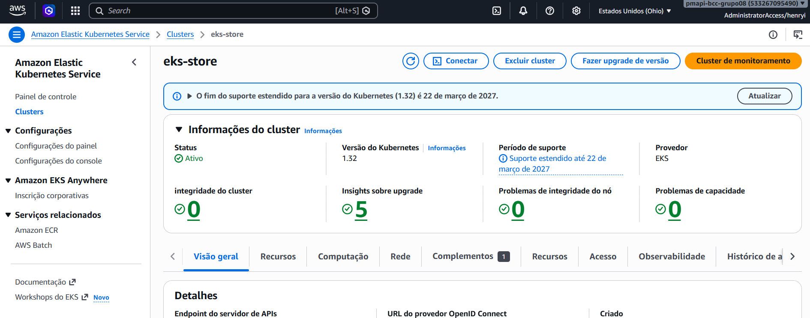
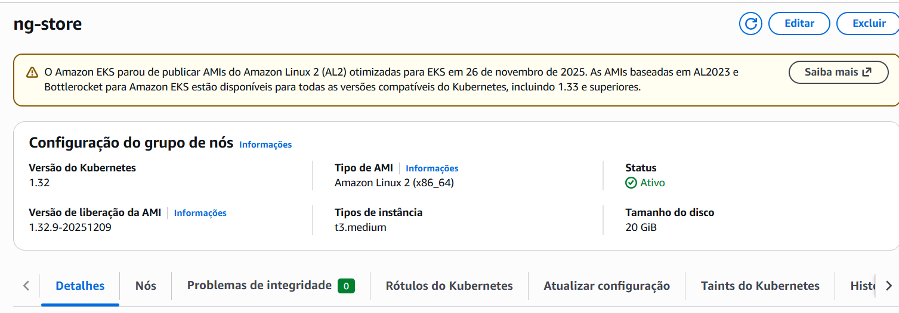
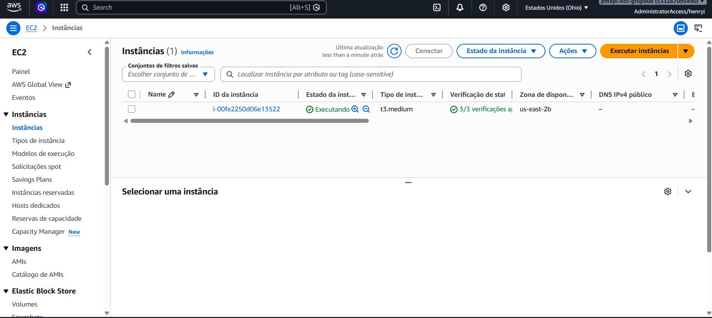

# EKS — Kubernetes na AWS

## Visão Geral do Cluster

O cluster EKS gerencia os pods de todos os microsserviços. O plano de controle (control plane) é gerenciado pela AWS — só os nodes EC2 são responsabilidade do projeto.

| Parâmetro | Valor |
|-----------|-------|
| Nome do cluster | `eks-store` |
| Região | `us-east-2` |
| Versão Kubernetes | `v1.32.9` |
| Node group | `ng-store` |
| Tipo de instância EC2 | `t3.medium` |
| Nodes desired / ativos | `1` |


*Console AWS → EKS → eks-store — visão geral do cluster*

### Node Group ng-store


*Console AWS → EKS → eks-store → Node Groups → ng-store*

---

## Criação do Cluster

O cluster foi criado com `eksctl`, que provisiona automaticamente VPC, subnets, roles IAM e node group:

```bash
eksctl create cluster \
  --name eks-store \
  --region us-east-2 \
  --nodegroup-name ng-store \
  --node-type t3.medium \
  --nodes 1
```

**Justificativa da instância EC2:** `t3.medium` oferece equilíbrio entre custo e capacidade de memória para rodar múltiplos pods simultaneamente. Instâncias maiores aumentariam custo sem benefício real no volume de carga do projeto.

---

## Configuração do kubectl

Após criação do cluster, configure o contexto local:

```bash
aws eks update-kubeconfig \
  --name eks-store \
  --region us-east-2
```

Verificar conectividade:

```bash
kubectl get nodes
kubectl get pods --all-namespaces
```

---

## Deploy dos Microsserviços

Após o build das imagens via Jenkins, o deploy no cluster é feito com:

```bash
kubectl set image deployment/order order=henryidesis/order:latest
kubectl rollout status deployment/order

kubectl set image deployment/gateway gateway=henryidesis/gateway:latest
kubectl rollout status deployment/gateway
```

---

## Exposição via NLB

O Gateway é exposto externamente através de um **Network Load Balancer** criado automaticamente pelo Kubernetes ao declarar um Service do tipo `LoadBalancer`:

```yaml
apiVersion: v1
kind: Service
metadata:
  name: gateway
spec:
  type: LoadBalancer
  ports:
    - port: 80
      targetPort: 8080
  selector:
    app: gateway
```

---

## Teardown

!!! warning "Execute após a apresentação"
    O node group `ng-store` gera custo enquanto estiver ativo. Desligue após a apresentação.

```bash
eksctl delete nodegroup \
  --cluster eks-store \
  --name ng-store \
  --region us-east-2

eksctl delete cluster \
  --name eks-store \
  --region us-east-2
```

Verifique recursos órfãos:

```bash
aws ec2 describe-instances \
  --region us-east-2 \
  --query 'Reservations[*].Instances[*].[InstanceId,State.Name,InstanceType]' \
  --output table

aws elbv2 describe-load-balancers \
  --region us-east-2 \
  --output table
```


*Console AWS → EKS → eks-store → Nodes (instâncias EC2 worker)*
