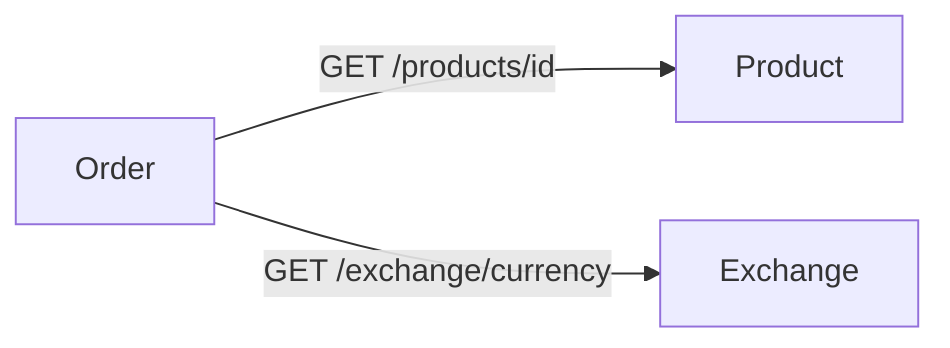

# Order API

**Responsável:** Henry Idesis  
**Documentação individual:** [microservice-henry.github.io/pma.26.1-docs](https://microservice-henry.github.io/pma.26.1-docs/)

---

## Descrição

API REST para gerenciamento de pedidos dos usuários autenticados. Integra-se com o Product Service (via OpenFeign) para obter os preços dos produtos, e com o Exchange Service para conversão de moeda nos totais.

---

## Endpoints

| Método | Rota | Descrição |
|--------|------|-----------|
| `POST` | `/orders` | Criar pedido para o usuário autenticado |
| `GET` | `/orders` | Listar pedidos do usuário autenticado |
| `GET` | `/orders/{id}` | Detalhar pedido (aceita `?currency=BRL`) |

---

## Inter-service communication

---

## Stack

| Tecnologia | Versão |
|-----------|--------|
| Java | 25 |
| Spring Boot | 4.0.3 |
| Spring Cloud OpenFeign | 2025.1.0 |
| PostgreSQL | 17 |
| Docker image | `henryidesis/order:latest` |

---

## Repositórios

| Módulo | Link |
|--------|------|
| Contrato (interface + DTOs) | [pma.261.order](https://github.com/microservice-henry/pma.261.order) |
| Implementação | [pma.261.order-service](https://github.com/microservice-henry/pma.261.order-service) |

---

!!! info "Documentação completa"
    Para endpoints detalhados, exemplos de request/response, como rodar localmente e bottlenecks implementados, acesse a [documentação individual de Henry](https://microservice-henry.github.io/pma.26.1-docs/).
