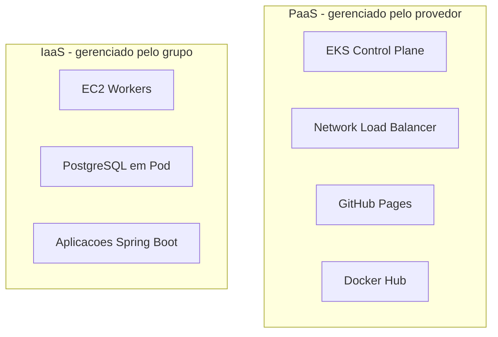

# PaaS

## O que é PaaS?

**Platform as a Service (PaaS)** é um modelo de computação em nuvem que entrega uma plataforma para construir, operar e administrar software sem a complexidade de gerenciar a infraestrutura subjacente.

---

## Componentes PaaS no Projeto

| Componente | Provedor | O que é gerenciado pelo provedor |
|------------|---------|----------------------------------|
| EKS Control Plane | AWS | Master nodes, etcd, API server, patches |
| NLB | AWS | Roteamento, failover, escalabilidade |
| Docker Hub | Docker Inc. | Registry de imagens, CDN global |
| GitHub Pages | GitHub | Hosting da documentação, SSL, CDN |

---

## Comparativo IaaS vs PaaS

---

## Vantagens Adotadas

- **EKS como PaaS:** eliminamos a complexidade de gerenciar o control plane do Kubernetes. A AWS garante alta disponibilidade dos masters sem custo de operação adicional para o time.

- **GitHub Pages como PaaS:** a documentação é publicada automaticamente a partir do repositório, sem necessidade de servidor de hospedagem próprio.

- **Docker Hub como PaaS:** registry global para as imagens dos microsserviços, com CDN integrado para pulls rápidos de qualquer região.
